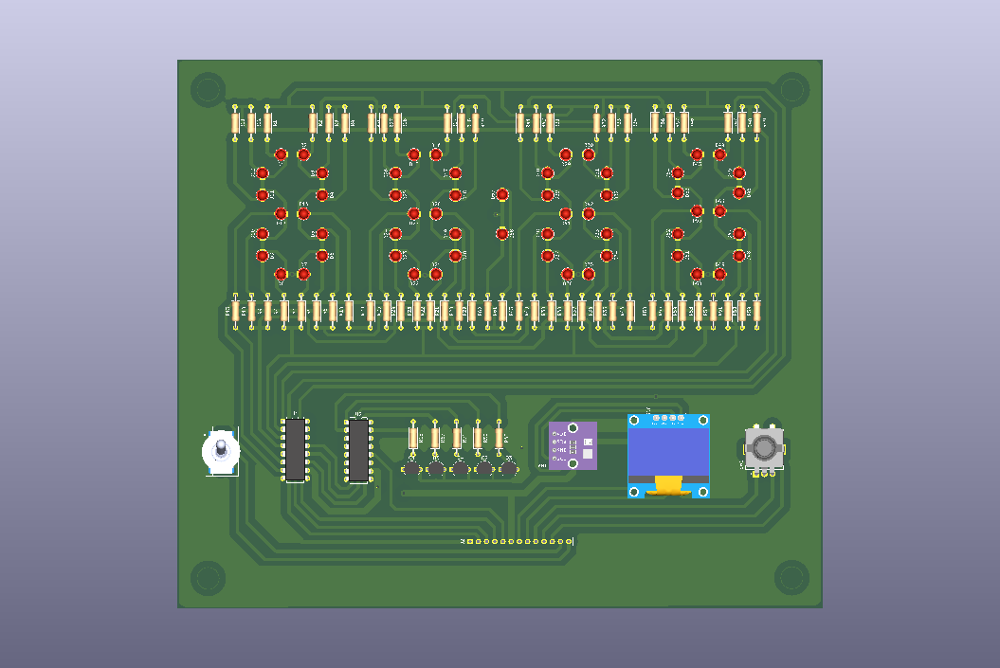
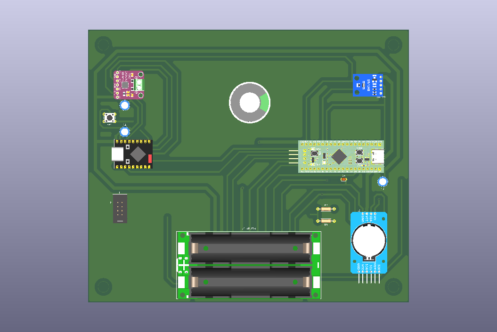
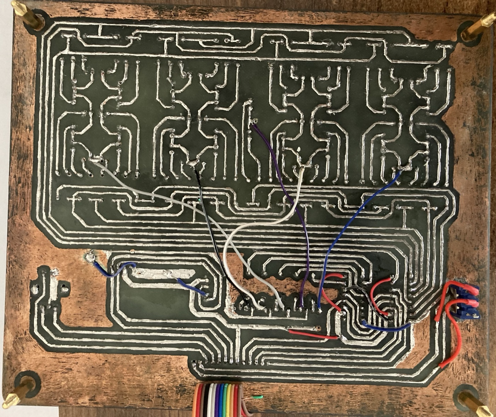
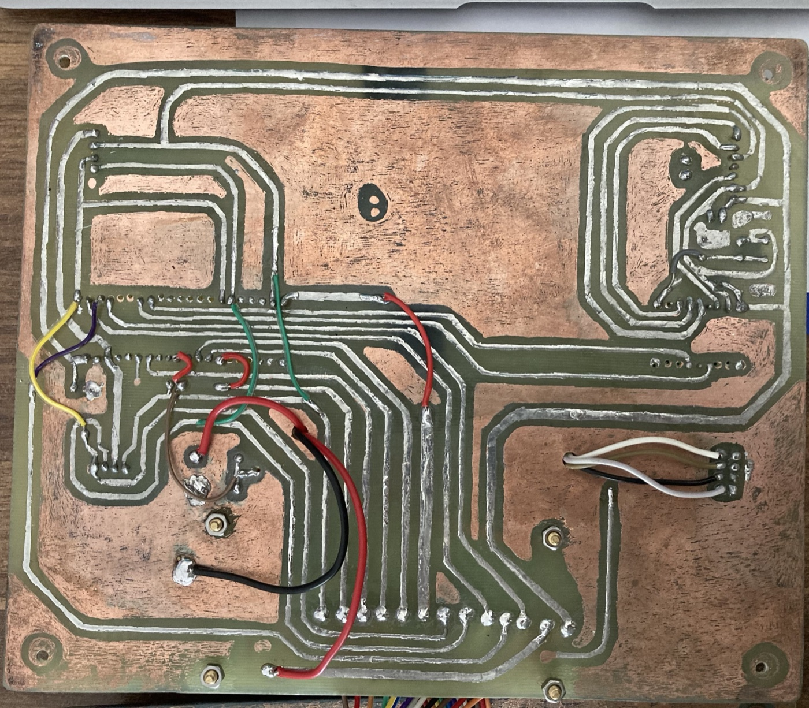

# SmartClock

Настільний розумний годинник на **STM32F411 (BlackPill)** та **ESP32-S3 Super Mini**: 7-сегментний LED-дисплей на дискретних світлодіодах, OLED-екран, датчики температури/вологості/тиску/освітленості, інтернет-радіо, будильник з mp3-мелодіями та резервне живлення від акумуляторів.

<p align="center">
  
  
</p>

📄 **[Повна технічна документація (PDF)](docs/SmartClock_Documentation.pdf)** — схеми, розведення плат, тактування, повний перелік компонентів з цінами.

---

## Можливості

- 🕐 **Годинник** з ходом реального часу (DS3231) — не збивається навіть без живлення
- 🔢 **7-сегментний LED-дисплей** на 58 дискретних світлодіодах — час, температура/вологість/тиск, індикатор освітленості
- 🖥️ **OLED-екран** — головне меню, статус WiFi, налаштування
- 📻 **Інтернет-радіо** — список станцій, регулювання гучності, через ESP32 + I2S-підсилювач
- ⏰ **Будильник** з 5 mp3-мелодіями (прев'ю прямо в меню), окрема гучність
- 🌙 **Нічний режим** — автояскравість LED за датчиком освітленості (BH1750), з гістерезисом проти блимання
- 📶 **WiFi-налаштування через QR-код** — точка доступу піднімається сама, конфігурація через веб-сторінку в браузері
- 🔋 **UPS-живлення** — 2×18650, безшовне перемикання на батарею при пропаданні зовнішнього живлення
- ⏱️ Секундомір

## Архітектура

Два контролери, кожен зі своєю роллю:

| Контролер | Відповідає за |
|---|---|
| **STM32F411** | Логіка годинника, меню й екрани (OLED + LED), читання датчиків (I2C), обробка енкодера, будильник, надсилання команд на ESP32 через UART |
| **ESP32-S3** | WiFi-підключення, точка доступу для першого налаштування (з QR-кодом), NTP-синхронізація часу, інтернет-радіо (I2S), відтворення mp3-мелодій будильника, веб-сторінка налаштувань |

Дві плати власної розробки (KiCad), з'єднані 13-контактним шлейфом.

## Фотографії зібраних плат

<p align="center">
  
  
</p>

## Меню користувача

```
Alarm (Будильник)
├── On/Off
├── Set Time
├── Melody     — 5 mp3, прев'ю на льоту
└── Volume

Radio (Радіо)
├── Stop
├── список інтернет-станцій
└── Volume

WiFi
├── Status
├── Reconnect
├── QR Code    — для першого підключення
└── Change WiFi

Settings (Налаштування)
├── Set Time / Set Date
├── LED Display     — час / погода / тиск
├── LED Interval
├── LED Brightness
├── Night Mode
└── Volume

Stopwatch (Секундомір)
```

## Апаратна платформа

- **STM32F411CEU6** («BlackPill») — головний контролер, ARM Cortex-M4 @ 96 МГц
- **ESP32-S3 Super Mini** — WiFi/аудіо співпроцесор
- **DS3231** — годинник реального часу з батарейним резервом
- **BMP280 + AHT20** — температура, тиск, вологість
- **BH1750** — освітленість (для нічного режиму)
- **SSD1306** — OLED 128×64
- **MAX98357A** + динамік 4 Ом 3 Вт — I2S аудіо
- **LX-2BUPS** + 2×18650 — резервне живлення
- 74HC595 ×2, BC337 ×5, 58 світлодіодів — дискретний 7-сегментний дисплей

Повний перелік компонентів з номіналами та цінами — у [документації](docs/SmartClock_Documentation.pdf) (розділ 7).

## Структура репозиторію

```
Core/            — прошивка STM32 (STM32CubeIDE, HAL)
Drivers/         — STM32 HAL/CMSIS
ESP32/           — прошивка ESP32-S3 (Arduino IDE)
docs/            — технічна документація та зображення
```

## Прошивка

- **STM32**: відкрити проєкт у STM32CubeIDE, зібрати та залити через ST-Link
- **ESP32**: відкрити `ESP32/SmartClock_ESP32/SmartClock_ESP32.ino` в Arduino IDE, залити скетч; mp3-файли з `ESP32/SmartClock_ESP32/data/` заливаються окремо на SPIFFS (Sketch Data Upload)
